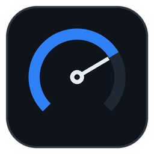

# AutoDiag Pro


[](https://github.com/ausgreekdev-cpu/autodiag-pro/releases/latest)

<p align="center">
  
</p>

**OBD-II scan tool** — desktop diagnostics app for ELM327 adapters (USB / Bluetooth SPP).

Dark-themed PySide6 dashboard that talks to your car's ELM327 adapter over a serial
port (USB cable or paired Bluetooth SPP dongle).

## Features

- **Overview dashboard** — the launch landing page: connection status with live
  voltage, VIN and supported-parameter count, trouble-code totals, emissions
  readiness (MIL + monitor completion), your last saved session, and one-click
  shortcuts into the panels
- **Live data** — engine RPM, speed, coolant, load, fuel trims, O2 sensors (voltage
  **and** short-term fuel trim per sensor)... ~40 SAE J1979 PIDs discovered from the
  vehicle (`0100` supported-PID bitmaps), four headline gauges + a scrolling graph of
  any ticked parameters
- **Trouble codes** — read stored (`03`), pending (`07`) and permanent (`0A`) DTCs
  with plain-English descriptions (5,112-code bundled dictionary); clear codes (`04`,
  MIL off) with confirmation
- **Readiness monitors** — I/M status: check emissions readiness before a smog test
- **Freeze frame** — sensor snapshot captured when a fault was set (`02`), with a
  frame 0/1/2 picker
- **Vehicle info** — VIN, calibration IDs, CVN (`09`)
- **Mode $06** — onboard test results (monitor + standardized test name vs. the
  min/max limits the ECU used, PASS/FAIL), with an *Only failures* filter
- **Reports** — export everything collected to JSON or CSV
- **Resilient link** — if the adapter drops mid-session the app reconnects by itself
  (1–15 s backoff, up to 5 attempts) with live status in the window
- **Remembers your setup** — last port, poll interval, panel and window layout are
  restored on launch; tick *Auto* in the toolbar to reconnect without clicking
- **Find parameters fast** — dashboard search (name or hex PID) + category filter
- **Graph snapshots** — save the live graph as a PNG (*Save image…*)
- **Graph windows + pause** — pick the visible time window (30 s / 2 min /
  10 min / All), freeze the plot with *Pause* while values keep logging, or
  start over with *Clear*
- **Every ECU's codes** — multi-ECU mode $03/$07/$0A replies are parsed per
  message, so a second ECU never produces phantom DTCs
- **Session history** — every scan auto-saves to disk on close (last 50 kept);
  browse, preview, re-export as JSON/CSV, or delete
- **Time-series CSV logs** — every polled value streams into a timestamped CSV
  (*Log*, on by default; newest 50 kept) and the matching history session links
  back to it
- **In-app log review** — the Log viewer charts any saved CSV: parameter picker,
  hover cursor readout, PNG export; jump straight from a history session's
  *View log…* button
- **Session compare** — diff any two saved sessions: codes added/removed,
  readiness and MIL flips, Mode $06 pass/fail changes, live-value deltas,
  plus a warning when the two VINs differ
- **PID explorer** — request any parameter on demand and see the raw response
  beside the decoded value; *Force* sends unsupported PIDs too, and one click
  pins the parameter to the dashboard graph
- **Update check** — press *Check for updates* in Settings (or run
  `autodiag updates`) to compare against the latest GitHub release; one
  request, only when you ask
- **Command-line tools** — headless `autodiag doctor` adapter smoke test
  (works without a car) and `autodiag scan` report generation

Fully offline: no accounts, no servers — everything runs on your machine.
The only optional network call is the update check you trigger yourself.

## Download

Prebuilt binaries for every release are on the
[Releases page](https://github.com/ausgreekdev-cpu/autodiag-pro/releases):

- **Linux (x86_64)** — `autodiag-linux-x86_64`: `chmod +x autodiag-linux-x86_64 && ./autodiag-linux-x86_64`
- **Windows (x86_64)** — `autodiag-windows-x86_64.exe`: double-click (SmartScreen may
  ask "More info → Run anyway" for unsigned builds)

Binaries are built by CI (`.github/workflows/release.yml`) on the tag — see
*Packaging a standalone executable* below to build from source instead.

## Status

| Milestone | Status |
|---|---|
| 1. Project bootstrap (tooling, CI) | done |
| 2. ELM327 session + serial transport | done |
| 3. Decoders (PIDs, DTC, freeze, readiness, VIN, Mode 06) | done |
| 4. Worker thread + polling scheduler | done |
| 5. UI core (dashboard, gauges, live graph) | done |
| 6. Diagnostic panels + settings + export | done |
| 7. Packaging (PyInstaller) + docs | done |
| 8. Persistence + UX polish (v0.3.0) | done |
| 9. Decoder hardening + session history (v0.4.0) | done |
| 10. Live-data CSV logger (v0.5.0) | done |
| 11. Log viewer (v0.6.0) | done |
| 12. Session compare (v0.7.0) | done |
| 13. CLI + hardware smoke test (v0.8.0) | done |
| 14. Graph windows + pause (v0.9.0) | done |
| 15. PID explorer (v0.10.0) | done |
| 16. Packaging polish (v0.11.0) | done |
| 17. Update check (v0.12.0) | done |
| 18. Overview dashboard (v0.13.0) | done |

## Install & run

```bash
python3 -m venv .venv
source .venv/bin/activate
pip install -e ".[dev]"

autodiag            # or: python -m autodiag
```

## Using the app

1. **Plug in the adapter** — USB serial, or pair the Bluetooth SPP dongle in your OS
   settings first (typical PIN `1234`/`0000`).
2. **Overview** — the landing page: connection status and live voltage, VIN with
   the supported-parameter count, trouble-code totals, emissions readiness, your
   last saved session, and quick-action buttons into the other panels. Fresh
   installs open here; once you pick a panel it is remembered.
3. **Pick the port** in the toolbar (press *Refresh* if it is not listed) and press
   **Connect**. The app auto-detects the baud rate, initializes the ELM327 and
   discovers which PIDs the vehicle supports. Tick *Auto* to reconnect to this port
   automatically on the next launch — the poll interval and window layout are
   remembered either way.
4. **Dashboard** — gauges and the value table update live; the poll interval (default
   250 ms) controls request spacing. Tick rows to graph those parameters, use
   *Filter parameters…* / the category dropdown to narrow the table, and *Save
   image…* to export the graph as a PNG. The *Window* dropdown limits the graph
   to the last 30 s / 2 min / 10 min (or *All* of the buffer), *Pause* freezes
   the plot without stopping the poll or the log, and *Clear* erases it. The
   *Log* checkbox (on by default) appends
   every polled value to a CSV in the app-data `logs/` folder — the label beside it
   shows the current file and row count; untick it to stop. Failed PIDs are dropped
   automatically after 3 timeouts, and a lost adapter connection is retried by itself
   (1 s → 15 s backoff, 5 attempts).
5. **Trouble codes** — press *Read codes*; switch tabs for pending/permanent.
   *Clear codes* asks for confirmation first.
6. **Readiness / Freeze frame / Vehicle info / Mode $06** — each panel has its own
   read button; results stay available for the report. The freeze-frame panel can
   read any of frames 0–2 and keeps each frame cached for comparison.
7. **Settings** — export the whole session (VIN, codes, monitors, Mode $06, latest
   readings) as JSON or CSV, or press *Check for updates* to compare the running
   version with the latest GitHub release.
8. **History** — past sessions appear here automatically when you close the app
   (the newest 50 are kept). Select one to preview it, re-export it as JSON/CSV,
   or delete it; the *Log* column shows which sessions have a CSV time series,
   and *View log…* opens one straight in the Log viewer. *Compare…* opens two
   sessions side by side — codes gained/lost, readiness flips, test changes
   and value deltas — defaulting to your selection against the newest other
   session.
9. **Log viewer** — pick any recorded log (or *Browse…* for a CSV elsewhere),
   tick parameters to plot them, hover the graph for a cursor readout, and
   *Export image…* to save the chart as a PNG.
10. **PID explorer** — pick any supported parameter (the rest of the SAE
    registry is listed too, marked *unsupported* and gated behind *Force*),
    press *Request* to see the raw response next to the decoded value, and
    *Graph this PID* to tick it in the dashboard graph.

## Command-line tools

The same `autodiag` entry point doubles as a headless CLI (no GUI, no Qt):

```bash
autodiag ports                # list serial ports
autodiag doctor               # adapter smoke test: banner, voltage, baud
autodiag doctor --vehicle     # ... + 0100 bus probe (ignition on)
autodiag scan -o report.json  # full headless scan → JSON/CSV report
autodiag updates              # compare against the latest GitHub release
```

- **ports** — every serial device the OS knows about (USB serial + paired BT SPP).
- **doctor** — verifies an ELM327 **without a vehicle**: reset banner, adapter id,
  voltage, auto-baud. Exit code 0 = PASS, 1 = FAIL, so it works in scripts.
  `--vehicle` additionally probes the bus (`0100`) and reports whether a vehicle
  answered (not required for PASS).
- **scan** — connects, reads VIN/DTCs/readiness/freeze frame/Mode $06, then polls
  live PIDs (`--pids`, default `0C,0D,05`) for `--seconds` (default 5) at
  `--interval` and writes the report. `--device` picks the port (defaults to the
  only port present); output defaults to `autodiag-scan-<timestamp>.json`.
- **updates** — one GitHub API request; prints the newer release (with URL) or
  "You're up to date". Exit code 0 = checked, 1 = the check failed.

Both `autodiag ...` and `python -m autodiag ...` work. On Windows prefer the
pip-installed `autodiag` script — the bundled `.exe` is a windowed GUI build.

## Development

```bash
ruff check .        # lint
pytest -q           # unit tests (no hardware needed — ELM327 fakes)
```

Tests run entirely against scripted fake adapters (`tests/fakes.py`), so no OBD
hardware is required. UI tests use Qt's offscreen platform. Seeded fuzz tests
(`tests/test_fuzz_decoders.py`) hammer every decoder with random garbage —
fixed seed, reproducible, contract-checked return types.

## Packaging a standalone executable

```bash
pip install -e ".[dev]"
pyinstaller --noconfirm autodiag.spec
./dist/autodiag                 # one-file executable (dist/autodiag.exe on Windows)
```

Requirements:

- **binutils** (`objdump` + `objcopy`) — part of any normal Linux build environment
  (`apt install binutils` / `dnf install binutils`)
- On Windows the spec produces `dist\autodiag.exe` with no extra tools

The build bundles the DTC dictionary, all Qt runtime libraries and pyqtgraph.
Building for a different OS must be done on that OS (PyInstaller does not
cross-compile).

## Hardware

Any ELM327-compatible adapter with a serial profile:

- **USB** — appears as `/dev/ttyUSB0` (Linux) or `COMx` (Windows)
- **Bluetooth SPP** — pair it in your OS settings first (e.g. PIN `1234` or `0000`),
  then pick the paired port in the app

Cheap ELM327 v1.5/v2.1 clones work; common baud rates (38400/57600/115200) are
auto-detected.

## Troubleshooting

| Symptom | Likely cause / fix |
|---|---|
| "Vehicle did not respond" | Ignition must be ON (engine may be off); check the adapter is fully seated |
| "No ELM327 response" on every port | Wrong port, or the dongle needs a different baud (the app tries 38400/115200/57600/9600) |
| Port missing from the list | Linux: add yourself to the `dialout` group, re-plug; Bluetooth: pair the SPP device first |
| Values stuck at `--` | Vehicle may not support those PIDs — the table only shows supported ones |
| CAN errors while polling | Slow the poll interval down (e.g. 500 ms) |
| Connection lost mid-scan | The app reconnects by itself (5 attempts over ~30 s); if it gives up, press *Connect* again |

## Project layout

```
autodiag/
  transports/   byte-pipe Transport ABC + serial (USB/BT SPP) implementation
  obd/          ELM327 session, response framing, J1979 decoders, DTC dictionary
  services/     ObdEngine loop, Qt worker thread, scan record, report export
  ui/           theme, main window, panels (dashboard/DTC/readiness/...), widgets
  data/         bundled data files (DTC descriptions + license)
tests/          pytest suite (fake serial / fake ELM327 / offscreen UI tests)
autodiag.spec   PyInstaller build recipe
```

Architecture in one paragraph: `ObdEngine` (pure Python) owns the ELM327 session —
it executes queued jobs (connect, read codes, ...) and round-robin-polls live PIDs,
dropping the link and auto-reconnecting with backoff when the transport fails.
`ObdWorker` runs it on a `QThread` and re-emits results as Qt signals. Panels
subscribe to those signals; `ScanRecord` accumulates everything for reports.
Everything speaks SAE J1979 (modes $01–$0A) — no cloud services anywhere.

## License

See repository for license details. The bundled DTC dictionary originates from an
Apache-2.0 npm package — see `autodiag/data/LICENSE-dtc-data.txt`.
